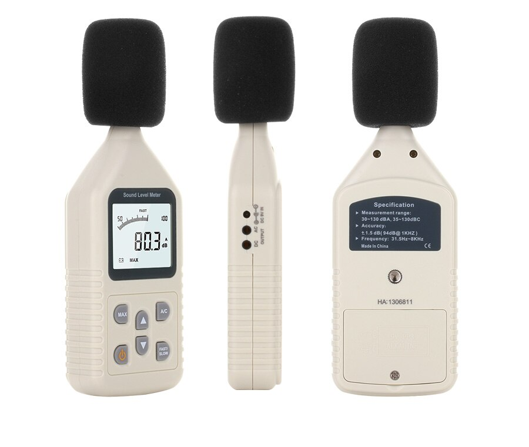

# picodeebee
Logging sound levels with a cheap decibel meter and a Raspberry Pi Pico

## Hardware

- Pimoroni Tiny 2040

- GM1358 Sound level meter (see below)

- ds3231 Real Time Clock module

The aim of this project is to adapt a cheap decibel meter so that it can log sound levels over an extended period. The decibel meter is one of several similar Chinese models available from AliExpress, Amazon etc. The particular model you need is called GM1358 - it should look exactly like the pictures below (note, especially, the pattern of buttons on the front, the three sockets on the side and the position of the label and battery cover on the back):

This particular model can be [easily hacked](https://forum.arduino.cc/t/hacking-a-sound-pressure-level-meter/367441) to provide a signal to (and be powered by) a cheap microcontroller board based on the RP2040. I used the [Pimoroni Tiny 2040](https://shop.pimoroni.com/products/tiny-2040), but you could use the [Raspberry Pi Pico](https://www.raspberrypi.org/products/raspberry-pi-pico/), [Adafruit Feather rp2040](https://www.adafruit.com/product/4884) or anything similar. The hacked meter presents a 0-1V signal (0.01V per dB) to an analogue input of the RP2040 and is powered by the 5V USB supply.

A Real Time Clock (RTC) module is needed to provide an accurate timestamp for measurements. I used a ds3231-based module that is widely sold on AliExpress and Amazon as a plug-and-play Raspberry Pi RTC device. You could use any reasonably accurate, battery-backed I2C clock module for this.

## Software

The firmware for the microprocessor is written in CircuitPython, so [follow the instructions](https://circuitpython.org/board/pimoroni_tiny2040/) to download and install the latest stable version of the CircuitPython UF2 file to the board. You'll also need the CircuitPython [Libraries Bundle](https://circuitpython.org/libraries) for the same version - you can either install the full libraries bundle or just copy the following modules into the `/lib` folder on the device:

- adafruit_ds3231.mpy

Use `tio /dev/ttyACM0` to monitor serial console

